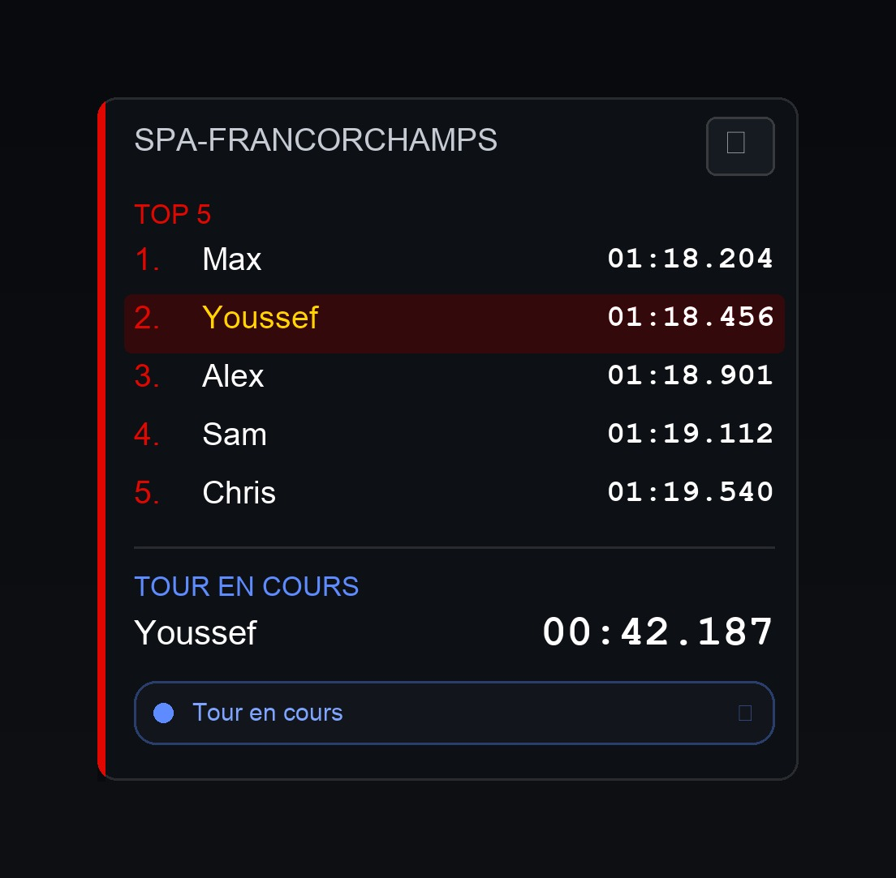

# F1 Chronos (MT_F1Chronos)

Overlay PC pour **EA Sports F1 25/26** (UDP **2025/2026**) : classement local par circuit, tour en cours live, export des scores.



## Fonctionnalités

- Overlay always-on-top (mode **Fenêtré** / **Borderless**)
- Nom d’affichage / icône : **F1 Chronos**
- **Nom du joueur** demandé à **chaque ouverture** (prérempli, sans réécrire l’historique)
- **TOP 5** ou **TOP 10** des meilleurs chronos du circuit
- Mise en évidence du **joueur courant** dans le classement
- **Tour en cours** synchronisé via télémétrie UDP (format `00:00.000`)
- **Scores par circuit** avec navigation ◀ ▶
- **Export** CSV / JSON / HTML
- Position mémorisée après déplacement
- **Fenêtre d’administration** (scores, reset, export, affichage, concours, debug)
- **Concours** : tableaux de scores parallèles (créer / démarrer / arrêter / exporter)
- Debug UDP intégré
- Réinitialisation des scores (mot de passe requis)

## Prérequis

- Windows 10/11
- [.NET 8 SDK](https://dotnet.microsoft.com/download/dotnet/8.0) (pour compiler)
- F1 25 ou F1 26 en **Fenêtré** ou **Borderless** (recommandé). Le plein écran exclusif peut masquer l’overlay.

## Configuration F1 25/26

Dans le jeu : **Settings → Telemetry Settings**

| Paramètre | Valeur |
|---|---|
| UDP Telemetry | **On** |
| UDP IP Address | `127.0.0.1` |
| UDP Port | `20888` |
| UDP Format | **`2025`** (F1 25) ou **`2026`** (F1 26) |
| UDP Send Rate | 20–60 Hz |

> Le format UDP dans le jeu et dans `settings.json` (`udpFormat`) doivent correspondre.

## Compilation

```powershell
cd MT_F1Chronos
.\build.ps1
```

Ce script :
1. Compile en Release vers `dist\MT_F1Chronos.exe`
2. Crée / met à jour le raccourci **Bureau** `F1 Chronos`
3. Crée / met à jour le raccourci **Démarrage Windows** `F1 Chronos`

Ou build seul :

```powershell
dotnet build -c Release
```

Exécutable : `dist\MT_F1Chronos.exe`

## Utilisation

1. Lancer `dist\MT_F1Chronos.exe`
2. Saisir / confirmer le **nom du joueur** (à chaque ouverture)
3. Lancer F1 en Borderless / Fenêtré et démarrer une session chrono
4. L’overlay affiche le circuit, le TOP, le tour en cours et l’état de connexion

Chaque tour **valide** (non cut) est enregistré avec le pseudo **au moment du tour**.

### Affichage overlay

| Zone | Contenu |
|---|---|
| En-tête | Nom du circuit + menu ☰ |
| TOP 5 / TOP 10 | Meilleurs chronos du circuit (joueur courant surligné) |
| Tour en cours | Chrono live `00:00.000` + pseudo |
| Statut | Connexion télémétrie |

### Menu burger (☰)

| Action | Description |
|---|---|
| Changer le nom du joueur | Pseudo pour les **prochains** tours |
| Administration | Fenêtre centralisée (scores, export, reset, affichage, debug) |
| Quitter | Ferme l’application |

### Administration

Menu ☰ → **Administration** :

| Section | Contenu |
|---|---|
| Scores globaux | Voir par circuit, reset circuit / tous (mdp requis) |
| Exportation | CSV / JSON / HTML du classement **global** |
| Source overlay | Global, ou un concours via « Afficher » |
| Affichage overlay | TOP 5 / TOP 10, taille Petit / Moyen / Grand |
| Concours | Créer, démarrer, arrêter, voir, exporter, supprimer |
| Diagnostic | Debug UDP |

Chaque tour valide alimente le **global** et **tous les concours actifs**. Arrêter un concours fige son tableau sans toucher au global.

### Raccourcis

| Action | Raccourci |
|---|---|
| Changer le nom du joueur | `Ctrl+Shift+N` |
| Déplacer l’overlay | Glisser l’en-tête (position sauvegardée) |

## Personnalisation

Fichier `%LOCALAPPDATA%\MT_F1Chronos\settings.json` :

```json
{
  "udpFormat": 2025,
  "udpPort": 20888,
  "overlayTop": 195,
  "overlayRight": 12,
  "overlayWidth": 288,
  "leaderboardSize": 5,
  "playerName": "TonNom",
  "overlayContestId": ""
}
```

| Clé | Description |
|---|---|
| `udpFormat` | `2025` ou `2026` (à aligner avec le jeu) |
| `udpPort` | Port UDP (défaut `20888`) |
| `overlayTop` / `overlayRight` | Position (aussi mise à jour au drag) |
| `overlayWidth` | Largeur (px) |
| `leaderboardSize` | `5` ou `10` |
| `playerName` | Dernier pseudo confirmé à l’ouverture |
| `overlayContestId` | Vide = global ; sinon id du concours affiché |

## Données

Scores globaux : `%LOCALAPPDATA%\MT_F1Chronos\sessions\track-{id}.json` (un fichier par circuit)

Concours : `%LOCALAPPDATA%\MT_F1Chronos\contests\`
- `index.json` — métadonnées des concours
- `{contestId}/track-{id}.json` — scores du concours

- Écriture atomique (`.tmp` → replace) et sauvegarde différée (~2 s), flush à la fermeture
- Au plus **5000** meilleurs tours conservés par circuit (global et par concours)
- Migration automatique depuis l’ancien `sessions.json` (renommé en `sessions.json.bak`)

Le TOP 5 / TOP 10 n’est qu’un filtre d’affichage sur ces données.

## Améliorations à venir

- Mode classement **meilleur tour / joueur / circuit** (une entrée par pseudo et par piste, au lieu de conserver tous les tours valides jusqu’au plafond)

## Architecture

```
MT_F1Chronos.Core   → UDP F1 2025/2026, parsing, stockage, export
MT_F1Chronos.App    → Overlay WPF, menus, hotkeys
assets/             → Icône F1 Chronos (app.ico)
```

## Debug UDP

Administration → **Ouvrir Debug UDP** : connexion, session, Lap Data, Time Trial, SessionStore, log des paquets.

## Limites

- Overlay externe uniquement (ne modifie pas l’UI du jeu)
- Nécessite la télémétrie UDP active
- Boutons de l’overlay cliquables (pas click-through)
- Fiable en **Borderless / Fenêtré** ; le plein écran exclusif peut le masquer

## Notes de version

### v0.11
- **Concours** : création, démarrage, arrêt, export, suppression
- Double écriture des tours (global + concours actifs)
- Overlay basculable Global / Concours (titre `TOP 5 · …`)

### v0.10
- Fenêtre **Administration** (scores, reset, export, affichage overlay, debug)
- Menu burger allégé : pseudo / Administration / Quitter
- Placeholder concours (implémentation prévue ensuite)

### v0.9.2
- Saisie du nom de joueur à **chaque** ouverture (prérempli)
- Suppression du slider d’opacité (opacité fixe)
- Format UDP configurable uniquement via `settings.json` (plus de menu)

### v0.9.1
- Stockage des scores par circuit (`sessions/track-{id}.json`)
- Écriture atomique + sauvegarde différée (~2 s)
- Plafond de 5000 meilleurs tours par circuit
- Migration depuis `sessions.json`

### v0.9
- Nettoyage et optimisation interne du code (aucun changement fonctionnel)

### v0.8.0
- `build.ps1` crée les raccourcis Bureau et Démarrage Windows vers `dist\MT_F1Chronos.exe`

### v0.7.1
- Conserve le branding **F1 Chronos** (nom + icône)
- Retire l’installateur Inno Setup, le publish self-contained, le démarrage auto et l’affichage de version

### v0.7.0
- (partiellement revert) Installateur / update / démarrage Windows / version UI — retiré en v0.7.1
- Branding F1 Chronos + icône conservés

### v0.6.1
- Fix doublon de chrono au redémarrage de session
- Affichage immédiat du nouveau circuit (plus besoin d’attendre un tour)
- Reset scores toujours disponible

### v0.6
- Suppression du delta live vs P1
- Format chrono toujours `00:00.000` (point décimal invariant)
- Position mémorisée après drag
- Opacité réglable 60–100 %
- Toggle TOP 5 / TOP 10
- Highlight du joueur courant dans le classement
- README réécrit

### v0.5
- Delta live vs P1 (retiré en v0.6)
- Export CSV / JSON / HTML
- Reset scores derrière feature flag + mot de passe

### v0.4.x
- Style F1 timing tower, menus alignés, barre de statut graphique
