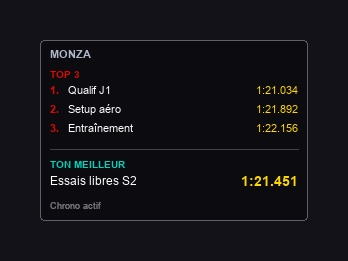

# MT_F1Chronos

Overlay PC pour **EA Sports F1 25** affichant le **TOP 5** de tes chronos nommés et ton **meilleur tour** de la session en cours.



## Fonctionnalités

- Overlay visible dans la **barre des tâches** (fenêtre principale, plus d'icône tray)
- Positionné en **haut-droite**, sous le panneau de chrono du jeu
- **Menu burger** cliquable : renommer, tous les scores, taille, quitter
- Affichage du **TOP 5** par circuit + **ton meilleur tour** actuel
- À chaque session chrono : popup pour **nommer la session**
- Raccourci global `Ctrl+Shift+N` pour renommer / créer un chrono
- Déplacement de l'overlay par **glisser-déposer** sur l'en-tête

## Prérequis

- Windows 10/11
- [.NET 8 SDK](https://dotnet.microsoft.com/download/dotnet/8.0)
- F1 25 en mode **Fenêtré** ou **Borderless** (pas plein écran exclusif)

## Configuration F1 25

Dans le jeu : **Settings → Telemetry Settings**

| Paramètre | Valeur |
|---|---|
| UDP Telemetry | On |
| UDP IP Address | `127.0.0.1` |
| UDP Port | `20777` |
| UDP Format | `2025` |
| UDP Send Rate | 20–60 Hz |

## Compilation

```powershell
cd MT_F1Chronos
dotnet build -c Release
```

L'exécutable se trouve dans :
`src/MT_F1Chronos.App/bin/Release/net8.0-windows/MT_F1Chronos.exe`

## Utilisation

1. Lancer `MT_F1Chronos.exe`
2. L'overlay apparaît en haut-droite et dans la barre des tâches
3. Lancer F1 25 et démarrer une session **Chrono / Time Trial**
4. Nommer la session dans la popup
5. L'overlay affiche le TOP 5 + ton meilleur tour

### Menu burger (☰)

| Action | Description |
|---|---|
| Changer le nom | Renomme la session active ou en crée une nouvelle |
| Tous les scores | Scores par circuit, navigation ◀ ▶ entre les circuits |
| Taille de l'overlay | Petit (220px) / Moyen (268px) / Grand (340px) |
| Quitter | Ferme l'application |

### Raccourcis

| Action | Raccourci |
|---|---|
| Renommer / nouveau chrono | `Ctrl+Shift+N` |
| Déplacer l'overlay | Glisser l'en-tête (nom du circuit) |

## Personnalisation position

Fichier `%LOCALAPPDATA%\MT_F1Chronos\settings.json` :

```json
{
  "udpPort": 20777,
  "overlayTop": 195,
  "overlayRight": 12,
  "overlayWidth": 268
}
```

Ajuste `overlayTop` / `overlayRight` pour caler l'overlay sur le carré rouge de ta capture.

## Données

Les sessions sont sauvegardées dans :
`%LOCALAPPDATA%\MT_F1Chronos\sessions.json`

## Architecture

```
MT_F1Chronos.Core   → Télémétrie UDP F1 25, parsing, stockage JSON
MT_F1Chronos.App    → Overlay WPF, popup nom, menu, hotkeys
```

## Limites

- Ne modifie pas l'UI native du jeu (overlay externe uniquement)
- Le TOP 5 regroupe tes sessions **nommées** avec un meilleur tour enregistré
- Nécessite la télémétrie UDP activée dans F1 25
