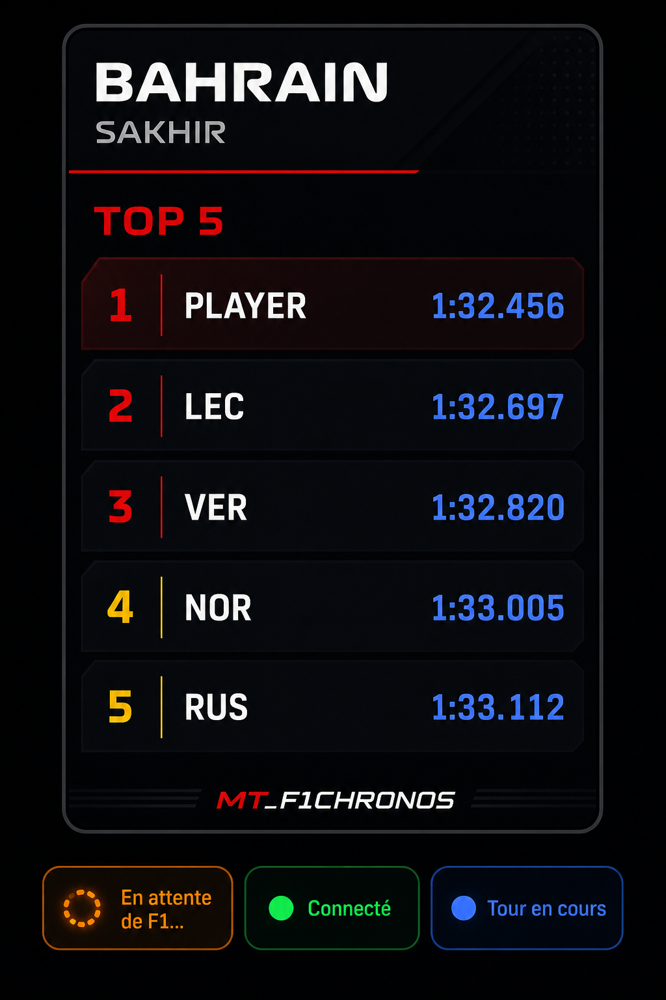

# MT_F1Chronos

Overlay PC pour **EA Sports F1 25/26** (format UDP **2025/2026**) : **TOP 5** par circuit, tour en cours, meilleur tour.



## Fonctionnalités

- Overlay visible dans la **barre des tâches** (fenêtre principale, pas d'icône tray)
- **Nom du joueur** demandé une seule fois au premier lancement
- **TOP 5** des meilleurs chronos du circuit en cours
- **Tour en cours** synchronisé en direct via télémétrie UDP
- **Meilleur tour** de la session active
- **Menu burger (☰)** cliquable avec options complètes
- **Scores par circuit** avec navigation ◀ ▶ entre les circuits
- Déplacement de l'overlay par **glisser-déposer** sur l'en-tête

## Prérequis

- Windows 10/11
- [.NET 8 SDK](https://dotnet.microsoft.com/download/dotnet/8.0)
- F1 25 ou F1 26 en mode **Fenêtré** ou **Borderless** (**recommandé**). Le **plein écran exclusif** peut passer au-dessus de l'overlay ; Borderless reste la config fiable.

## Configuration F1 25/26

Dans le jeu : **Settings → Telemetry Settings**

| Paramètre | Valeur |
|---|---|
| UDP Telemetry | **On** |
| UDP IP Address | `127.0.0.1` |
| UDP Port | `20777` |
| UDP Format | **`2025`** pour F1 25, **`2026`** pour F1 26 |
| UDP Send Rate | 20–60 Hz |

> Le format dans le jeu et dans l'overlay (menu ☰ → **Format UDP**) doivent correspondre.

## Compilation

```powershell
cd MT_F1Chronos
dotnet build -c Release
```

Ou avec le script fourni :

```powershell
.\build.ps1
```

L'exécutable se trouve dans :
`src\MT_F1Chronos.App\bin\Release\net8.0-windows\MT_F1Chronos.exe`

## Utilisation

1. Lancer `MT_F1Chronos.exe`
2. Saisir ton **nom de joueur** à la première ouverture (modifiable ensuite)
3. L'overlay apparaît en haut-droite de l'écran
4. Lancer F1 et démarrer une session **Chrono / Time Trial**
5. L'overlay affiche automatiquement :
   - le **circuit détecté**
   - le **tour en cours** (chrono live)
   - ton **meilleur tour**
   - le **TOP 5** du circuit

Aucune popup ne s'affiche à chaque session — le nom du joueur est réutilisé automatiquement.

### Affichage overlay

| Zone | Contenu |
|---|---|
| En-tête | Nom du circuit + menu ☰ |
| TOP 5 | 5 meilleurs chronos du circuit en cours |
| Tour en cours | Chrono live du tour actuel |
| Meilleur tour | Meilleur temps enregistré cette session |

### Menu burger (☰)

| Action | Description |
|---|---|
| Changer le nom du joueur | Modifie le pseudo pour les **prochains** tours (l'historique conserve les anciens noms) |
| Scores par circuit | Tous les scores du circuit, navigation ◀ ▶ |
| Taille de l'overlay | Petit (220 px) / Moyen (268 px) / Grand (340 px) |
| Format UDP | **2025** (F1 25) ou **2026** |
| Diagnostic UDP | Ligne technique de debug |
| Quitter | Ferme l'application |

### Raccourcis

| Action | Raccourci |
|---|---|
| Changer le nom du joueur | `Ctrl+Shift+N` |
| Déplacer l'overlay | Glisser l'en-tête (nom du circuit) |

## Personnalisation

Fichier `%LOCALAPPDATA%\MT_F1Chronos\settings.json` :

```json
{
  "udpFormat": 2025,
  "udpPort": 20777,
  "overlayTop": 195,
  "overlayRight": 12,
  "overlayWidth": 268,
  "playerName": "TonNom"
}
```

| Clé | Description |
|---|---|
| `udpFormat` | Format parser : **2025** ou **2026** (défaut 2025) |
| `overlayTop` | Distance depuis le haut de l'écran (px) |
| `overlayRight` | Distance depuis le bord droit (px) |
| `overlayWidth` | Largeur de l'overlay (px) |
| `playerName` | Pseudo utilisé pour les **prochains** tours enregistrés |

Ajuste `overlayTop` / `overlayRight` pour caler l'overlay sous le panneau de chrono du jeu.

## Données

Les chronos sont sauvegardés dans :
`%LOCALAPPDATA%\MT_F1Chronos\sessions.json`

Le fichier est lu au démarrage et réécrit à chaque tour terminé (et à la fermeture). Les scores **survivent** à la fermeture / réouverture de l'exe.

Chaque **tour terminé** crée une entrée `{ nom du moment, circuit, temps, date }`. Toutes les entrées sont conservées ; le **TOP 5** n'est qu'un filtre d'affichage (les 5 meilleurs du circuit). Changer le pseudo ne renomme pas l'historique.

## Architecture

```
MT_F1Chronos.Core   → Télémétrie UDP F1 2025/2026, parsing paquets, stockage JSON
MT_F1Chronos.App    → Overlay WPF, fenêtre nom joueur, menu burger, hotkeys
```

### Diagnostic UDP

Active le mode diagnostic via le menu ☰ → **Diagnostic UDP**. Une ligne technique s'affiche sous le statut :

```
cfg 2025 · rx 2025 · pkt 2 · lapPkt 2 · car 0 · trk 2 (Shanghai) · lap 45.230 / best 44.891 · drv 1 · 18 pkt/s
```

| Valeur | Signification | Valeur attendue |
|---|---|---|
| `cfg 2025` | Format configuré dans l'overlay | doit = format jeu |
| `rx 2025` | Format reçu du jeu | **2025** ou **2026** |
| `pkt 2` | Dernier paquet reçu | varie |
| `lapPkt 2` | Dernier paquet Lap Data | **2** en roulant |
| `car 0` | Voiture détectée | 0 en solo |
| `trk 2 (Shanghai)` | Circuit (ID + nom) | doit correspondre |
| `lap …` | Tour en cours | augmente en roulant |
| `best …` | Meilleur tour | se remplit après un tour |
| `drv 1` | Statut pilote | 1, 2, 3 ou 4 en roulant |
| `pkt/s` | Débit UDP | > 10 si connecté |

Si `cfg` ≠ `rx`, change le **Format UDP** dans le menu. Si `lapPkt` reste 0 en roulant, vérifie le format.

## Limites

- Ne modifie pas l'UI native du jeu (overlay externe uniquement)
- Nécessite la télémétrie UDP activée (format **2025** ou **2026** selon le jeu)
- L'overlay couvre une petite zone de l'écran (boutons cliquables, non click-through)
- Le TOP 5 affiche les 5 meilleurs tours enregistrés sur le circuit en cours (tous les tours restent en base)
- L'overlay est forcé au premier plan (`HWND_TOPMOST`) en fenêtré / **Borderless** ; le **plein écran exclusif** du jeu peut tout de même le masquer
