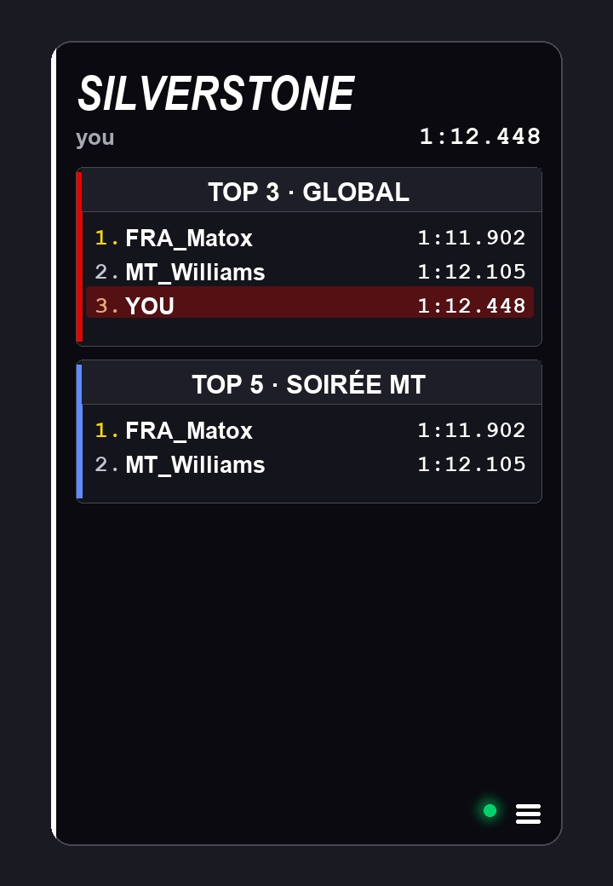

# F1 Chronos (MT_F1Chronos)

Overlay PC pour **EA Sports F1 25/26** (UDP **2025/2026**) : classement local par circuit, tour en cours live, export des scores.



## Fonctionnalités

- Overlay always-on-top (mode **Fenêtré** / **Borderless**)
- Nom d’affichage / icône : **F1 Chronos**
- **Nom du joueur** demandé à **chaque ouverture** (prérempli, sans réécrire l’historique)
- **TOP 3** / **TOP 5** / **TOP 10** des meilleurs chronos du circuit
- Mode **meilleur chrono par joueur** (toggle overlay + Scores)
- Mise en évidence du **joueur courant** dans le classement (fond rouge)
- **Tour en cours** synchronisé via télémétrie UDP (format `00:00.000`)
- **Scores par circuit** : filtre joueur, mode meilleur / joueur (gestion/suppression via admin)
- **Export** CSV / JSON / HTML
- Position mémorisée après déplacement
- **Fenêtre d’administration** protégée par mot de passe (reset, export, affichage, concours, debug)
- **Concours** : tableaux de scores parallèles (créer / démarrer / arrêter / exporter) ; global limité au TOP 3 quand le concours est affiché
- Debug UDP intégré
- Réinitialisation des scores depuis l’administration

## Prérequis

- Windows 10/11
- [.NET 8 SDK](https://dotnet.microsoft.com/download/dotnet/8.0) (pour compiler)
- F1 25 ou F1 26 en **Fenêtré** ou **Borderless** (recommandé). Le plein écran exclusif peut masquer l’overlay.

## Configuration F1 25/26

Dans le jeu : **Settings → Telemetry Settings**

| Paramètre | Valeur |
|---|---|
| UDP Telemetry | **On** |
| UDP IP Address | `127.0.0.1` |
| UDP Port | `20888` |
| UDP Format | **`2025`** (F1 25) ou **`2026`** (F1 26) |
| UDP Send Rate | 20–60 Hz |

> Le format UDP dans le jeu et dans `settings.json` (`udpFormat`) doivent correspondre.

## Compilation

```powershell
cd MT_F1Chronos
.\build.ps1
```

Ce script :
1. Compile en Release vers `dist\MT_F1Chronos.exe`
2. Crée / met à jour le raccourci **Bureau** `F1 Chronos`
3. Crée / met à jour le raccourci **Démarrage Windows** `F1 Chronos`

Ou build seul :

```powershell
dotnet build -c Release
```

Exécutable : `dist\MT_F1Chronos.exe`

## Utilisation

1. Lancer `dist\MT_F1Chronos.exe`
2. Saisir / confirmer le **nom du joueur** (à chaque ouverture)
3. Lancer F1 en Borderless / Fenêtré et démarrer une session chrono
4. L’overlay affiche le circuit, le TOP, le tour en cours et l’état de connexion

Chaque tour **valide** (non cut) est enregistré avec le pseudo **au moment du tour**.

### Affichage overlay

| Zone | Contenu |
|---|---|
| En-tête | Nom du circuit + menu ☰ |
| TOP 3 / 5 / 10 · GLOBAL | Meilleurs chronos du circuit (joueur courant surligné) |
| TOP 3 / 5 / 10 · CONCOURS | Optionnel : classement du concours lié |
| Tour en cours | Chrono live `00:00.000` + pseudo |
| Statut | Connexion télémétrie |

### Menu burger (☰)

| Action | Description |
|---|---|
| Changer le nom du joueur | Pseudo pour les **prochains** tours |
| Scores par circuit | Liste complète (choix Global / Concours), navigation ◀ ▶ |
| Administration | Fenêtre centralisée (mdp requis) |
| Quitter | Ferme l’application |

### Administration

Menu ☰ → **Administration** (mot de passe requis) :

| Section | Contenu |
|---|---|
| Scores | **Gérer les chronos** (suppression ciblée, circuit, concours, reset) |
| Exportation | Source (Global / concours) + circuit (tous / un) · CSV / JSON / HTML |
| Affichage overlay | TOP 3 / 5 / 10 **global** (largeur auto) |
| Concours | Contenu overlay (Global+Concours / Concours seul / Global seul), TOP 3/5/10, créer / gérer |
| Serveur de résultats | Connexion **optionnelle** (URL, jeton, intervalle) — n’altère pas l’enregistrement local |
| Diagnostic | Debug UDP |

Chaque tour valide alimente le **global** et **tous les concours actifs**.  
Sur l’overlay : selon le mode choisi — **Global + Concours principal**, **Concours principal seul**, ou **Global seul**.

### Raccourcis

| Action | Raccourci |
|---|---|
| Changer le nom du joueur | `Ctrl+Shift+N` |
| Déplacer l’overlay | Glisser l’en-tête (position sauvegardée) |

## Personnalisation

Fichier `%LOCALAPPDATA%\MT_F1Chronos\settings.json` :

```json
{
  "udpFormat": 2025,
  "udpPort": 20888,
  "overlayTop": 195,
  "overlayRight": 12,
  "overlayWidth": 288,
  "leaderboardSize": 5,
  "playerName": "TonNom",
  "overlayContestId": "",
  "showContestOnOverlay": true,
  "contestLeaderboardSize": 10,
  "hideGlobalWhenContest": false,
  "resultsServerEnabled": false,
  "resultsServerUrl": "https://classement.exemple.com",
  "resultsServerToken": "",
  "simulatorId": "",
  "simulatorLabel": "",
  "resultsSyncIntervalSeconds": 120
}
```

| Clé | Description |
|---|---|
| `udpFormat` | `2025` ou `2026` (à aligner avec le jeu) |
| `udpPort` | Port UDP (défaut `20888`) |
| `overlayTop` / `overlayRight` | Position (aussi mise à jour au drag) |
| `overlayWidth` | Largeur (px) |
| `leaderboardSize` | `5` ou `10` (classement **global**) |
| `playerName` | Dernier pseudo confirmé à l’ouverture |
| `overlayContestId` | Id du concours **principal** (vide = aucun) |
| `showContestOnOverlay` | Afficher le concours principal (`false` = mode Global seul) |
| `contestLeaderboardSize` | `5` ou `10` (classement **concours**) |
| `hideGlobalWhenContest` | Masquer le TOP global (`true` = mode Concours seul) |
| `resultsServerEnabled` | `false` par défaut — active l’envoi des tableaux vers le serveur |
| `resultsServerUrl` | Base URL HTTPS du serveur (`https://hostname`, port **443** implicite) |
| `resultsServerToken` | Jeton généré dans l’admin web du VPS |
| `simulatorLabel` | Nom affiché sur le site |
| `resultsSyncIntervalSeconds` | 15–600 (défaut 120) — pull périodique des jobs |

## Données

Scores globaux : `%LOCALAPPDATA%\MT_F1Chronos\sessions\track-{id}.json` (un fichier par circuit)

Concours : `%LOCALAPPDATA%\MT_F1Chronos\contests\`
- `index.json` — métadonnées des concours
- `{contestId}/track-{id}.json` — scores du concours

- Écriture atomique (`.tmp` → replace) et sauvegarde différée (~2 s), flush à la fermeture
- Au plus **5000** meilleurs tours conservés par circuit (global et par concours)
- Migration automatique depuis l’ancien `sessions.json` (renommé en `sessions.json.bak`)

Le TOP 3 / 5 / 10 n’est qu’un filtre d’affichage sur ces données.

## Améliorations à venir

- Mode classement **meilleur tour / joueur / circuit** (une entrée par pseudo et par piste, au lieu de conserver tous les tours valides jusqu’au plafond)

## Architecture

```
MT_F1Chronos.Core   → UDP F1 2025/2026, parsing, stockage, export, contrat sync
MT_F1Chronos.App    → Overlay WPF, menus, hotkeys, client sync optionnel
server/             → Serveur Linux FastAPI + SQLite (Docker/Podman)
assets/             → Icône F1 Chronos (app.ico)
```

## Serveur de résultats (optionnel, VPS Linux)

Le overlay du simulateur **reste autonome**. Le VPS est une archive / vitrine. Le simu (derrière NAT) **initie** toujours HTTP ; le serveur ne rappelle jamais le PC.

Caddy écoute **80** (ACME Let's Encrypt + redirect) et **443** (HTTPS). FastAPI reste interne au réseau Docker (8080 non publié).

```bash
./scripts/init-env.sh   # génère .env (mdp admin + secret cookie aléatoires)
# édite .env :
#   RESULTS_DOMAIN=simracing-dc.yseddiki.fr
#   CADDY_EMAIL=ton@email.fr

# Podman rootless (une fois, avec sudo) — sinon erreur « privileged port 80 » :
sudo ./scripts/setup-podman-ports.sh

docker compose up -d --build
# ou : podman compose up -d --build

# Vérifier TLS + health :
./scripts/check-results-ssl.sh
```

`RESULTS_DOMAIN` doit être le **FQDN public** (Let's Encrypt refuse IP / `localhost`). DNS A/AAAA → VPS, ports **80** et **443** ouverts (`ufw allow 80,443/tcp`).

Si `ERR_SSL_PROTOCOL_ERROR` : Caddy n’écoute pas en TLS (souvent `RESULTS_DOMAIN` incorrect, conteneur caddy arrêté, ou ports 80/443 bloqués). Voir `podman compose logs caddy`.

**Build Docker : `Read timed out` / `No matching distribution found for fastapi`** : PyPI est trop lent depuis le VPS (timeout réseau, pas une version manquante). Le `Dockerfile` utilise déjà des timeouts pip allongés (300 s). Si ça échoue encore :

```bash
# Le compose utilise déjà network: host pour le build (pip → PyPI).
sudo docker compose build
sudo docker compose up -d

# Tester l’accès PyPI depuis le serveur
curl -I --max-time 30 https://pypi.org/simple/fastapi/

# Sans compose : build Docker classique (flag --network ici, pas sur compose build)
sudo docker build --network=host -t mt-f1chronos-results:latest -f server/Dockerfile server
```

Vérifie aussi pare-feu / DNS (`8.8.8.8` en resolver) et qu’aucun proxy ne bloque le HTTPS sortant.

`RESULTS_ADMIN_PASSWORD` n’est utilisé **qu’au premier démarrage** (hashé en SQLite). Ensuite, change-le dans `/admin`. Relancer le script ne change plus le login.

1. Ouvre `https://<ton-domaine>/admin` → crée un simulateur → **copie le jeton**
2. Sur le PC F1 Chronos : Administration → Serveur de résultats → URL `https://<ton-domaine>` (sans `:8080`), jeton, intervalle → Tester / Activer
3. LED overlay : télémétrie (jeu) **et** serveur (VPS) à côté

Le client normalise l’URL en **HTTPS / 443** (un ancien `:8080` est retiré). Les `POST /api/v1/sync` partent donc sur le 443.

Le simu envoie un snapshot à chaque maj de tableau et selon l’intervalle choisi (15 s–10 min). Les suppressions / renames admin créent des **jobs** récupérés au pull. Un revert est possible tant que le job n’est pas annulé. **Vider la DB du VPS ne touche pas le simu.**

Un simulateur est **hors ligne** s’il n’a rien envoyé pendant **2 × son intervalle** de sync.

## Debug UDP

Administration (mdp) → **Ouvrir Debug UDP** : connexion, session, Lap Data, Time Trial, SessionStore, log des paquets.

## Limites

- Overlay externe uniquement (ne modifie pas l’UI du jeu)
- Nécessite la télémétrie UDP active
- Boutons de l’overlay cliquables (pas click-through)
- Fiable en **Borderless / Fenêtré** ; le plein écran exclusif peut le masquer

## À revoir plus tard

Idées techniques / produit à reprendre quand on voudra durcir ou enrichir l’app :

- **`TelemetryState` thread-safe** : aujourd’hui l’état est muté sur le thread UDP et lu sur le thread UI sans verrou. Remplacer par un snapshot immuable (copie à chaque update) pour éviter toute lecture incohérente.
- **Mot de passe admin hors binaire** : sel + hash OK pour l’instant ; plus tard, secret configurable (fichier local protégé ou saisie à la première exécution) plutôt que hash embarqué.
- Mode classement **meilleur tour / joueur / circuit** (filtre best-per-player)
- Installateur avec mise à jour (suite v0.7 partiellement retirée)

## Notes de version

### v1.1
- Overlay : toggle « meilleur chrono / joueur », burger vectoriel, picto chrono, LED un peu plus grosse, ombres douces + micro-animations
- Scores : filtre par joueur, mode meilleur / joueur ; gestion/suppression centralisée dans **Administration → Gérer les chronos**

### v1.0
- **Première version stable** de F1 Chronos
- Overlay brand (carbon / rouge) : typographie circuit, cartouches TOP, liseré blanc, coins arrondis
- Classements **TOP 3 / 5 / 10** ; avec concours affiché, le global passe en TOP 3
- Pseudo limité à 20 caractères ; largeur d’overlay auto (compacte, s’étend si besoin)
- Surbrillance joueur courant par fond uniquement ; rangs P1–P3 en couleur de texte

### v0.15
- Overlay : TOP prioritaire, médailles P1–P3, status télémétrie (carré bas droite), feedback léger à l’enregistrement
- Admin : barre segmentée Global+Concours / Concours seul / Global seul ; cartes concours allégées
- Cohérence visuelle des fenêtres secondaires (menu, scores)

### v0.13
- **Scores par circuit** : sélecteur de source Global / Concours
- Overlay concours : TOP 5 ou TOP 10 + option pour masquer le TOP global
- Administration protégée par mot de passe ; scores accessibles depuis le menu ☰

### v0.11
- **Concours** : création, démarrage, arrêt, export, suppression
- Double écriture des tours (global + concours actifs)
- Overlay : TOP global + TOP 10 concours optionnel en dessous

### v0.10
- Fenêtre **Administration** (scores, reset, export, affichage overlay, debug)
- Menu burger allégé : pseudo / Administration / Quitter
- Placeholder concours (implémentation prévue ensuite)

### v0.9.2
- Saisie du nom de joueur à **chaque** ouverture (prérempli)
- Suppression du slider d’opacité (opacité fixe)
- Format UDP configurable uniquement via `settings.json` (plus de menu)

### v0.9.1
- Stockage des scores par circuit (`sessions/track-{id}.json`)
- Écriture atomique + sauvegarde différée (~2 s)
- Plafond de 5000 meilleurs tours par circuit
- Migration depuis `sessions.json`

### v0.9
- Nettoyage et optimisation interne du code (aucun changement fonctionnel)

### v0.8.0
- `build.ps1` crée les raccourcis Bureau et Démarrage Windows vers `dist\MT_F1Chronos.exe`

### v0.7.1
- Conserve le branding **F1 Chronos** (nom + icône)
- Retire l’installateur Inno Setup, le publish self-contained, le démarrage auto et l’affichage de version

### v0.7.0
- (partiellement revert) Installateur / update / démarrage Windows / version UI — retiré en v0.7.1
- Branding F1 Chronos + icône conservés

### v0.6.1
- Fix doublon de chrono au redémarrage de session
- Affichage immédiat du nouveau circuit (plus besoin d’attendre un tour)
- Reset scores toujours disponible

### v0.6
- Suppression du delta live vs P1
- Format chrono toujours `00:00.000` (point décimal invariant)
- Position mémorisée après drag
- Opacité réglable 60–100 %
- Toggle TOP 5 / TOP 10
- Highlight du joueur courant dans le classement
- README réécrit

### v0.5
- Delta live vs P1 (retiré en v0.6)
- Export CSV / JSON / HTML
- Reset scores derrière feature flag + mot de passe

### v0.4.x
- Style F1 timing tower, menus alignés, barre de statut graphique
